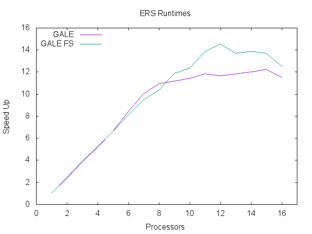
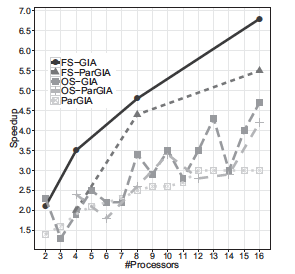
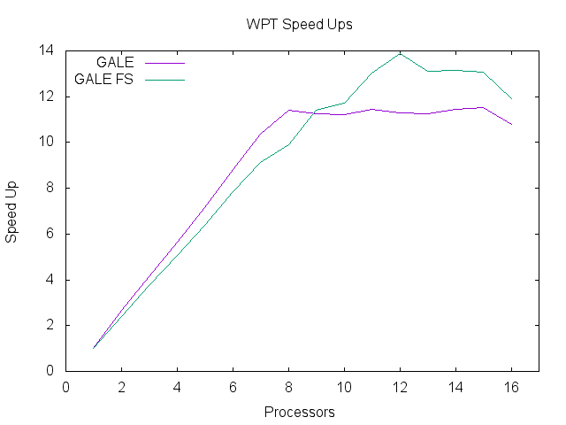
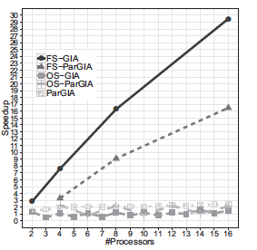

## Feature Space Division
- Randomly select **n** * 25 points and construct a decision tree with **n** leaves. **n** represents the number of processor.
- For each leaf identify the range of inputs(decisions).
- For each processor: randomly assign input range of one leaf.
- Decisions will now be generated within only this input range.
- Experiment was conducted 20 times

# Results.
## ERS Feature Model

### Runtimes
| Processors |    GALE    | GALE FS | ParGIA |
|:----------:|:-----------:|:-------------:|:----------:|
|1| 250.67 +/- 23.05 | 250.67 +/- 23.05 |62.12|
|2| 105.15 +/- 4.60 | 100.86 +/- 1.43 |32.60|
|3| 65.23 +/- 3.17 | 63.73 +/- 1.24 |46.70|
|4| 47.88 +/- 0.67 | 47.53 +/- 0.68 |29.89|
|5| 37.9 +/- 0.43 | 37.82 +/- 0.94 |25.08|
|6| 29.69 +/- 0.07 | 30.80 +/- 1.41 |31.36|
|7| 25.03 +/- 0.15 | 26.33 +/- 1.29 |29.27|
|8| 22.82 +/- 0.38 | 24.14 +/- 1.52 |16.90|
|9| 22.43 +/- 0.59 | 21.04 +/- 1.29 |25.53|
|10| 21.92 +/- 0.65 | 20.26 +/- 1.15 |19.46|
|11| 21.12 +/- 0.61 | 17.23 +/- 0.73 |26.76|
|12| 21.47 +/- 0.26 | 17.23 +/- 0.73 |18.45|
|13| 21.15 +/- 0.42 | 18.31 +/- 1.18 |17.12|
|14| 20.87 +/- 0.51 | 18.05 +/- 1.72 |24.06|
|15| 20.45 +/- 0.74 | 18.29 +/- 1.65 |17.29|
|16| 21.69 +/- 0.63 | 20.02 +/- 2.75 |14.60|

### Speedups

### BaseLine

## WPT Feature Model

### Runtimes
| Processors |    GALE    | GALE FS | ParGIA |
|:----------:|:-----------:|:-------------:|:----------:|
|1| 269.37 +/- 2.17 | 269.37 +/- 2.17 | 10151.69|
|2| 100.81 +/- 1.72 | 113.03 +/- 1.07 |4299.47|
|3| 65.28 +/- 1.11 | 71.86 +/- 0.91 |11118.42|
|4| 47.61 +/- 1.26 | 53.11 +/- 2.91 |4308.46|
|5| 37.63 +/- 0.47 | 42.17 +/- 1.59 |10606.78|
|6| 30.57 +/- 0.23 | 34.23 +/- 1.76 |4034.11|
|7| 25.96 +/- 0.08 | 29.50 +/- 1.14 |7612.78|
|8| 23.58 +/- 0.32 | 27.22 +/- 2.03 |4077.85|
|9| 23.96 +/- 0.49 | 23.57 +/- 2.03 |6811.58|
|10| 23.99 +/- 0.22 | 22.98 +/- 2.64 |4028.05|
|11| 23.53 +/- 0.34 | 20.66 +/- 0.96 |6566.03|
|12| 23.85 +/- 0.29 | 19.38 +/- 1.93 |3729.90|
|13| 23.91 +/- 0.16 | 20.54 +/- 1.59 |4949.09|
|14| 23.56 +/- 0.28 | 20.49 +/- 2.53 |3497.46|
|15| 23.39 +/- 0.08 | 20.59 +/- 0.95 |4536.61|
|16| 24.94 +/- 0.26 | 22.64 +/- 3.44 |3191.49|

### Speedups

### BaseLine

